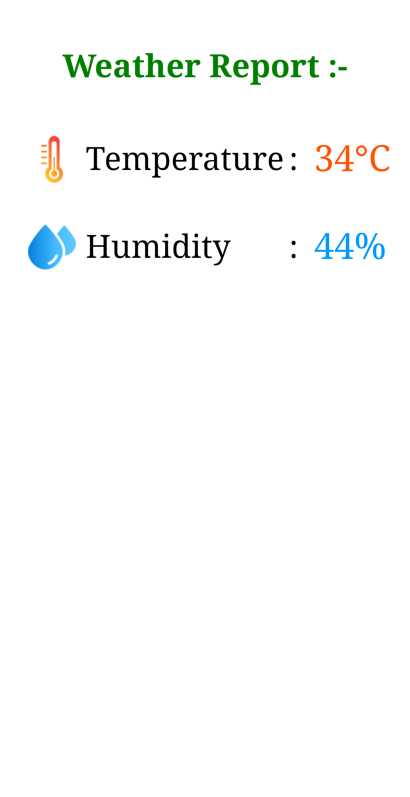

# Temperature and Humidity Web Interface with ESP32 (PlatformIO)

This project uses an ESP32 with a DHT11 sensor to display real-time temperature and humidity data on a web interface accessible over your local network. Built with PlatformIO for streamlined development.

---

## Hardware Requirements

- ESP32 Development Board
- DHT11 Temperature and Humidity Sensor
- Jumper wires
- Breadboard (optional)

---

## Features

- Reads temperature and humidity from DHT11 sensor
- Serves a web interface accessible via local network
- Compatible with PlatformIO IDE


## Wiring

| DHT11 Pin | ESP32 Pin            | Description             |
|------------|----------------------|-------------------------|
| VCC        | 3.3V or 5V           | Power                   |
| GND        | GND                  | Ground                  |
| DATA       | GPIO 21 (or your pin) | Data signal             |

*Adjust the GPIO in code if using a different pin.*

---
## Getting Started

1.  **Clone the repository:**

    Open your terminal or command prompt and use the following command to clone the project:

    ```bash
    git clone https://github.com/akarshit-1609/Temperature_and_Humidity_Web_Interface_with_ESP32.git
    ```

2.  **Open in PlatformIO:**

    Open the cloned project in your preferred IDE with the PlatformIO extension installed (e.g., VS Code).

3.  **Configure Variables:**

    Before uploading the code to your ESP32, you need to configure some variables, particularly the GPIO pin.

    *   **Locate the configuration:** Open the `src/main.cpp` file.
    *   **Find the variable:** Look for a line similar to this:

        ```c++
        const char* ssid = "Your_ssid"; // Replace with your custom ssid
        const char* password = "your_password"; // Replace with your password

        const int sensorPin = 21; // Replace with your sensor data GPIO pin
        ```

    *   **Replace the value:** Replace `Your_ssid` and `your_password` with your Wi-Fi credentials and Change the `21` to the actual GPIO pin number where your sensor data pin is connected on your ESP32 board. Refer to your ESP32 board's pinout diagram if you are unsure.

4.  **Build and Upload:**

    *   Connect your ESP32 board to your computer via USB.
    *   In PlatformIO, click the "Build" button to compile the project.
    *   Click the "Upload" button to upload the compiled code to your ESP32.

## Project Structure

*   `platformio.ini`: PlatformIO configuration file.
*   `src/main.cpp`: The main source code file.
*   `lib/`: (Optional) Directory for external libraries.


## Usage

Once the code is uploaded, connect any device with esp32 wifi by ssid and password given in the code after open the browser and type url http://192.168.0.1 in your browser to view current temperature and humidity.

---

## Screenshot of web interface for demo



**Enjoy your ESP32-based environment monitor!**

---

## License

This project is licensed under the MIT License. See the `LICENSE` file for details.